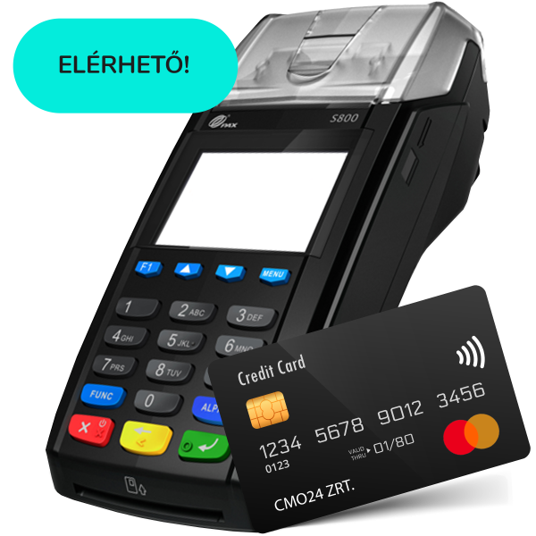
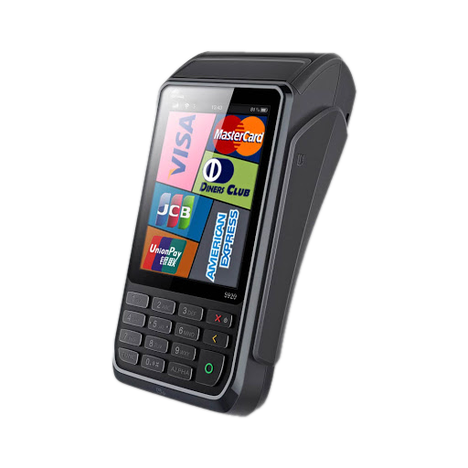

# Bankkártya terminál típusok

## PAX S800 bankkártya terminál

### Technikai leírás

|  |  |
| --- | --- |
Processor | 32-bit ARM11
Memory | 192MB standard (128MB Flash, 64MB DDR). Micro SD (TF card) up to 32GB
Display | 2.8 inch 320 x 240 pixels TFT colour LCD
Keypad | 10 numeric / letter keys, 7 function keys. Back-lighting
Printer| Thermal printer, Speed: 30 lines per second or faster depending on font size. Paper roll width / diameter:  58mm / 50mm
Card Slots | 3 SAMs or 2SAMs, 1 SIM or 1 SAM, Dual SIM
Magnetic Card Reader | Track 1/2/3, bi-directional
Smart Card Reader | EMV L1 & L2
Contactless Card Reader | MasterCard Contactless & Visa payWave, American Express ExpressPay, Discover DPAS, ISO/IEC 14443 Type A/B, Mifare®, Felica, NFC
Audio | Speaker, 90dB
Communication | Modem: Sync. (HDLC up to 9600bps), Asnyc. (V.92, up to 56Kbps), Ethernet, WiFi (optional), GPRS / 3G (WCDMA) (optional)
Peripheral Ports | 1 x RS232, 1 x Ethernet, 1 x PINpad, 1 x Line, 2 x Mini USB
Security | DUKPT, Master/Session, 3DES, ANSI/ISO9564 format 0, 1,3, PIN ciphered key algorithm, ANSI X 9.9/X9.19 MAC algorithm
Environmental | 0°C to 50°C (32°F to 122°F) operating temperature, 10% to 93% relative humidity, non-condensing, -20°C to 70°C (-4°F to 158°F) storage temperature
Voltage | Input: 100～240VAC，50Hz/60Hz, 1A, Output: 9VDC, 1A
Physical | Length: 203mm, Width: 86mm, Height: 70mm
Weight | 454g
Certifications | PCI PTS 4.x, SRED, EMV Contact L1 & L2, EMV Contactless L1, Visa payWave, MasterCard Contactless, AMEX Expresspay, JCB J/Speedy, MasterCard TQM

## PAX S920 bankkártya terminál

### Technikai leírás

|  |  |
| --- | --- |
OS | Prolin
Processor | 32-bit ARM 11
Memory | 64MB DDR + 128MB Flash I Micro SD Card Slot, Supports up to 32GB
Card Readers | Magnetic Card Reader, Smart Card Reader, Contactless Card Reader
Display | 3.5-Inch TFT Colour, 320 x 240Pixels, Capacitive Touchscreen
Audio | Speaker Volume up to 90 dB
Physical Keypad | 10 x Numeric / Alphabet Keys, 5 x Function Keys
Communications | WiFi (2.4G), 4G (Cat-4), 3G (WCDMA), 2G (GPRS), Bluetooth 4.0
Card Slots | 1 x SIM + 2 x SAM, 2 x SIM + 1 x SAM (optional)
Peripheral Port | 1 x Micro USB 2.0, OTG
Printer | Print Speed: 30l/s, Paper Width: 40mm, Paper Diameter: 58mm
Battery | 3.7V / 3250mAh Rechargeable Li-ion Battery
Adapter / Power | Input: 100 - 240V AC, 50Hz / 60Hz, Output: 5.0V DC, 1.0A
Location | GPS (optional)
Accessories | Charging Base (optional), Communication & Charging Base (optional)
Physical | L x W x H (mm) : 165 x 78 x 61, Weight (g) : 362 (Including Battery)
Environmental | -10°C ~ 50°C (14°F ~ 122°F) Operating Temperature, -20°C ~ 70°C (-4°F ~ 158°F) Storage Temperature, 10% ~ 93% Relative Humidity, Non-condensing
Certifications | PCI PTS 4.x, SRED, EMV L1 & L2, EMV Contactless L1, Visa payWave, MasterCard Contactless, American ExpressPay, Discover D-PAS, MasterCard TQM, Interac_Flash L2, J/Speedy L2, PTCRB, ABECS,APCA, UL, CE, FCC, Anatel, RoHS
