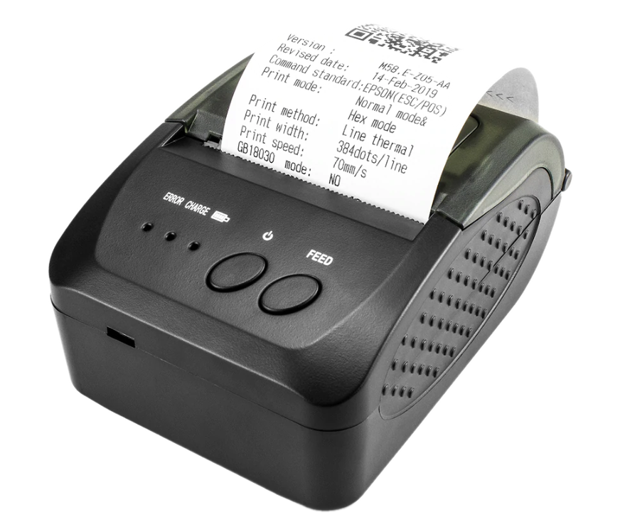
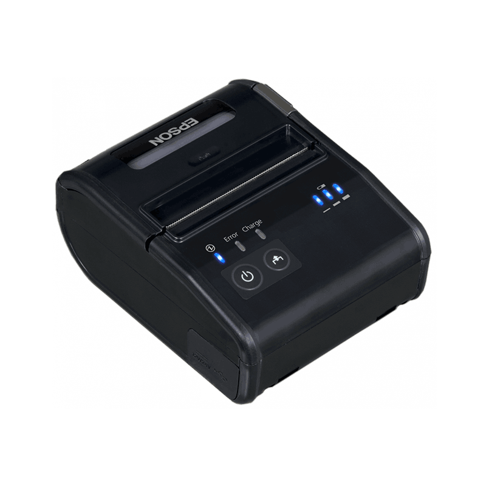
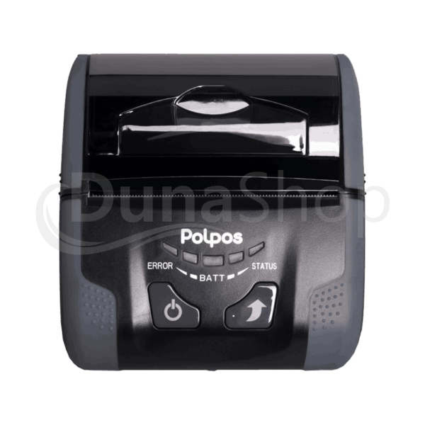
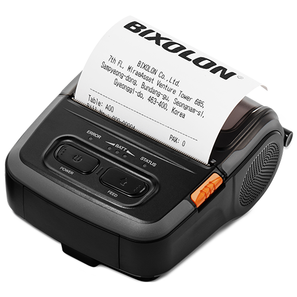

# Gyakran ismételt kérdések

## Be kell jelenteni a számlázót a NAV-nál?
!> Minden cég / E.V. köteles a NAV felé bejelenteni az általa használt online számlázó programot! 
A számlázó program bejelentés történhet elektronikus úton (ÁNYK), illetve papíralapon. Fontos hogy az adatszolgáltatásnak 30 napon belül meg kell történnie az adóhatoság felé.

Az általunk fejlesztett számlázó program bejelentéshez szükséges adatok.

|  |  |
| --- | --- |
| Alkalmazás azonosító: | CMO-06840000000000 | 
| Számlázó alkalmazás neve: | CMO | 
| Fejlesztő neve: | CMO24 Zrt. | 
| Fejlesztő adószáma: | 25321478-2-03 |
| Elérhetőség: | https://cmo.hu/ |  

## NAV technikai felhasználó
> Lehetőség van a technikai felhaszáló beállítására QR kód beolvasásával, ebben az esetben csak a jelszó mezőt kell kitöltened!

<iframe class="video-container" src="https://www.youtube.com/embed/ek7ERk9cti8" frameborder="0" allow="accelerometer; encrypted-media; gyroscope; picture-in-picture" allowfullscreen></iframe>

## Hogyan kell párosítani a számlanyomtatót?
> Kapcsold be a számlanyomtatót. Aktíváld a mobil eszközödön a Bluetooth -ot, és keresd meg a párosítani kívánt eszközt.
Ha sikeres volt a nyomtató csetlakoztatása a mobilapp "Beállítások/Nyomtatók/" menűben ki tudod választani, hogy az a nyomtató legyen az alapértelmezett nyomtatód, hogy a kiállítot számlát akár papíralapon is át tud addni az ügyfelednek.

### Netum NT-1809DD

Párosító kód: 1234

### Epson TM-P80

Párosító kód: Nem kér kódot

### Polpos MP80

Párosító kód: 0000

### Bixolon SPP-R310/ALT

Párosító kód: 0000

