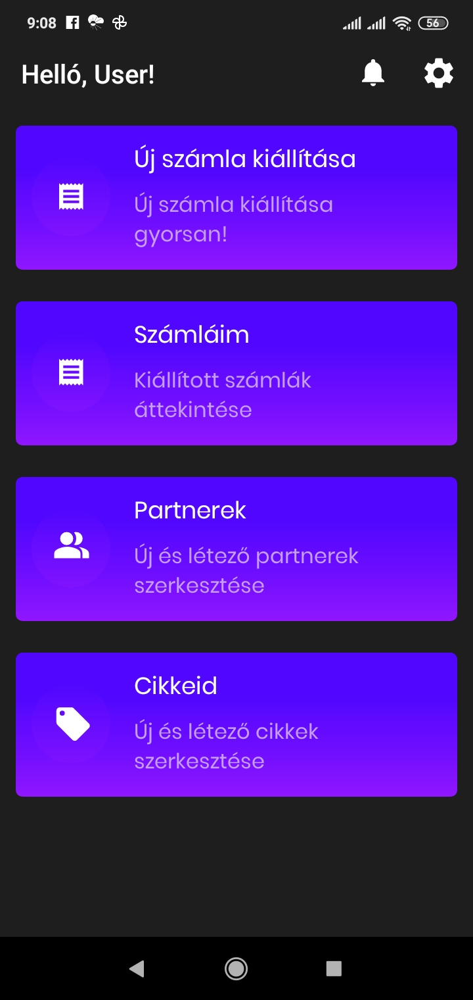

# Használati útmutató

## Telepítés

A számlázó mobilapplikáció elérgető Android és iOS operációs rendszert futtató eszközökre is.
Amennyiben telefonról böngészed az oldalt, csak kattints az operációs rendszerednek megfelelő linkre, és odanavigálunk az appunkhoz az áruházban.

Amennyiben asztali számítógepen böngészed az oldat, csak keress rá a mobilod áruházában a "CMO Számlázó" -ra, hogy letölthesd az alkalmazást.

## Regisztráció

> Amennyiben regisztráltál már a webalkalmazásunkba, nincs más dolgod, mint azzal a felhasználónévvel bejelentkezni a mobilalkalmazásunkba, és minden beállításod, cikked, és partneredet látni fogod.

### Az app első indítása

### Friss 5

- Válaszd ki az applikáció nyelvét.
- Ha még nincs CMO felhasználói fiókod hozd létre egyszerűen.
- Add meg a felhaszálói fiók létrehozásához szükséges alapadatokat, fogadd el az adatkezelési, és szerződési feltételeket.

### Felhasználó regisztrálása

### Cég regisztrálása

!> Számlát addig nem tudsz kiállítani, míg a NAV technikai felhasználó nincs beállítva!

## Bejelentkezés

## Menütérkép

- Beállítások
- Cég szerkesztése
- Általános adatok
- Törzsadatok
- ÁFA kulcsok
- Mértékegységek
- Bolt hozzáadása
- Bankügyi adatok
- NAV technikai felhasználó
- Cégeim
- Cég hozzáadása
- Profilom
- Nyomtatók
- Számlázás beállítások
- Alapértelmezett cikk
- Alapértelmezett cikk törlése / kiválasztása
- Alapértelmezett fizetési mód
- Partner automatikus mentése számlakiállításakor
- Nyelv
- Téma
- Felhasználók kezelése
- Alkalmazás adatai
- Adatkezelési tájékoztató
- Szerződési feltételek
- Kijelentkezés
- Új számla kiállítása
- Számláim
- Új számla kiállítása
- Partnerek
- Új partner hozzáadása
- Partner múdosítása
- Cikktörzs
- Új cikk hozzáadása
- Cikk módosítása
- Boltjaid
- Üzlet címe
- Pénztárgépek
- Készletek
