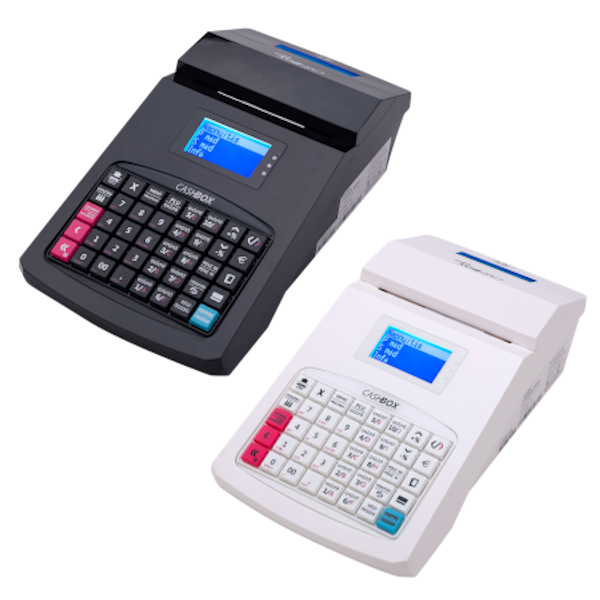
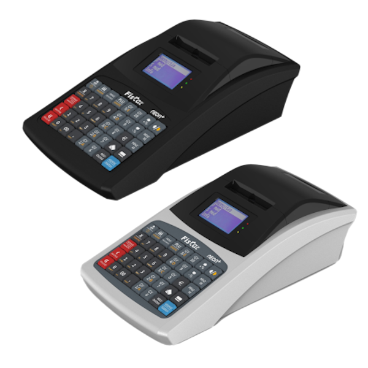

# Pénztárgép típusok

## CashBox Base online pénztárgép

### Felhasználási terület
A CashBox pénztárgép család első tagja a base nevet kapta, mely hasonlóan a CashCube típusokhoz megbízható, könnyen használható bármilyen üzletben (max 650 nyugta/nap átlagban), ahol számít a kompakt méret, nagy tudás, megvilágítható nagyobb méretű kijelző, a könnyű, gyors papírtekercs csere és a kerekítős euró-szabványú szoftver. Kezelése, apróbb fejlesztésektől eltekintve, megegyezik a CashCube modellekével. Vonalkódolvasó csatlakoztatásával lehetőség nyílik egy gyorsabb, egyszerűbb és látványosabb értékesítésre. A külső kijelző csatlakoztatásával pedig távolabb is elhelyezhet vevőtájékoztató kijelzőt. A kapott összeg elhelyezését segíti a kompakt méretű, CashCube/CashBox márkanevet viselő pénz tartó kasszafiók, mely szervizes segítség nélkül összekapcsolható a pénztárgéppel. A pénztárgép 57,5mm széles termo nyomtatóval rendelkezik (22 sor nyomtatására képes másodpercenként) melynek nagy előnye még a gyors egy pattintásos papírszalag csere. Hamarosan használható lesz a wifi/LAN hálózaton keresztüli felhőszolgáltatás elérése, valamint a  készülékbe épített NFC használata is Legyen szó mérlegkezelésről, bankkártya terminál vagy számítógép (vagy a későbbiekben felhő szolgáltatás) csatlakoztatásáról a CasHBox base online pénztárgép mindig hű és innovatív társa lesz a munkában. 

### Technikai leírás
A pénztárgép gyors termo nyomtatóval rendelkezik (22 sor/sec) melynek nagy előnye még a gyors egy pattintátos papírszalag csere. Legyen szó mérleg kezelésről vagy bankkártya terminál vagy számítógép (vagy a későbbiekben, wifi/UTP hálózaton keresztül, felhő szolgáltatás) csatlakoztatásáról a CashBox base online pénztárgép mindig hű és innovatív társa lesz a munkában.

|  |  |
| -------------- | ----------- |
| Engedély szerinti típus: | CashBox base online pénztárgép | 
| Forgalmazó: | LA Pénztárgép Kft | 
| Gyártó: | Xiamen Fiscat Electronic Co. Ltd. | 
| Mobilszolgáltató:	| Magyar Telekom Zrt | 
| MKEH engedély száma: | A240 | 
| Méret (szél x mély x mag) mm:	| 191mm x 326mm x 94mm | 
| Tömege (kg): | 1,1 kg | 
| Nyomtató típusa,módja: | Hőnyomtató | 
| Nyomtatás sebessége: | 22 sor / másodperc | 
| Nyomtatott karakterek száma: | 12*24 pixel, 32 karakter / sor | 
| Papírméret: | 57 mm/ 50mm/ 30méter | 
| PLU-k száma: | 10.000 | 
| Kezelhető pénztárosok száma: | 30 fő | 
| Funkció billentyűk száma:	| 40 billentyű / 10 közvetlen gyűjtő | 
| PC program PLU feltöltéshez: | nincs | 
| Külső csatlakozások:	Fizikai : | 2 db USB A, 1 db USB AB, 1db Ethernet, 1 db RS232 RJ12,1db kasszanyitó RJ12, Tápfesz 9V csatlakozó. Rátehető: Vonalkód olvasó, fizető terminál, Mérleg, PC , kassza 12V | 
| Elektronikus ellenörző szalag: | igen van és nyomtatható magával a pénztárgéppel | 
| Szoftver frissítések: | Távolról NAV-on keresztül | 

*Forrás: A pénztárgép forgalmazója: [LA Pénztárgép Kft.](https://www.apenztargep.hu/)*

## Fiscat Neon+ Wifi online pénztárgép

### Technikai leírás
|  |  |
| -------------- | ----------- |
| Terméknév:| Fiscat Neon+WiFi |
| Engedélyszám:| A241 |
| Forgalmazó:| EURO-DUPLEX KFT. |
| Felhasználási terület:| Kis- és közepes forgalmú üzletek |
| Méretek:| 326 * 191 * 94 mm |
| Súlya:| ~1.3 kg |
| Nyomtató:| Hőnyomtató, gyors papírbefűzés mechanizmussal, papírkifogyás-érzékelő |
| Kijelzők:| háttérvilágítással rendelkező LCD vevő és kezelői kijelzők |
| Nyomtatási sebesség:| 70 mm/s |
| Papírméret:| 57 mm hőpapír |
| Billentyűzet:| A 40 darab strapabíró műanyag gomb elhelyezése ergonomómiailag átgondolt, ezáltal segítik a produktivitást. Az egyszerű piktogrammok gyorsabban felismerhetők a kiírt szövegnél. A különböző funkció csoportok színek szerint különválnak tovább segítve az eladót. Elsődleges funkciók fehér, míg a másodlagos funkciók narancsárga színüek. |
| Akkumulátor:| Beépített lithium back-up akkumulátor (több órányi akkus üzem) |
| Funkciók:| Beépített WiFi, Beépített Bluetooth, Beépített NFC, LAN port, Felhő támogatás |
| Csatlakoztatható:| kasszafiók, mérleg, vonalkódolvasó, külső vevőkijelző |

*Forrás: A pénztárgép forgalmazója: [Euro-Duplex Kft.](https://priorcash.hu/)*