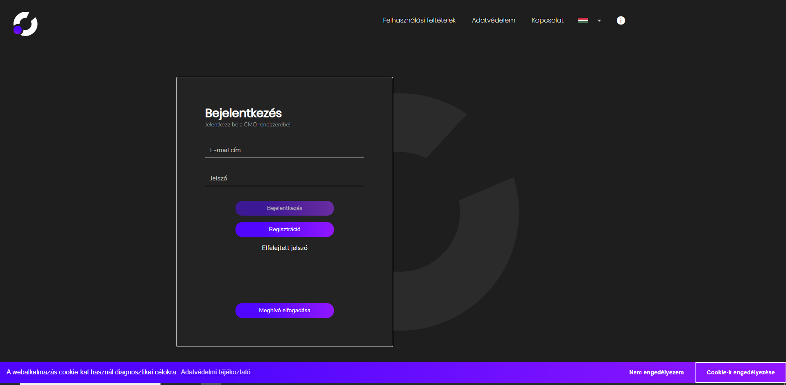
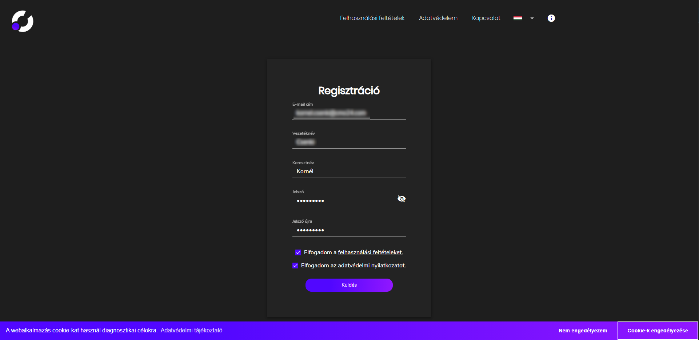
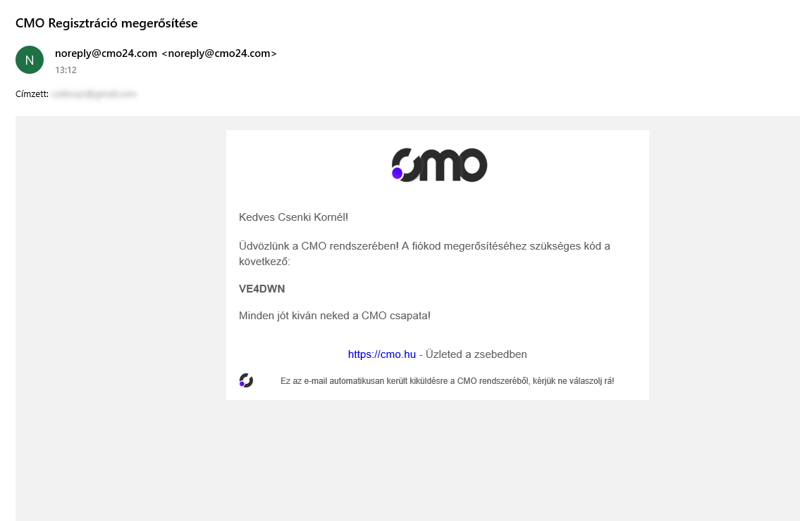
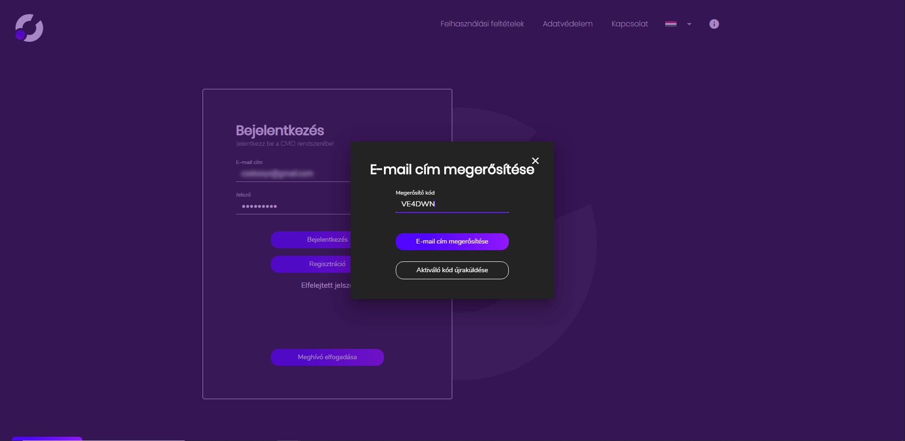
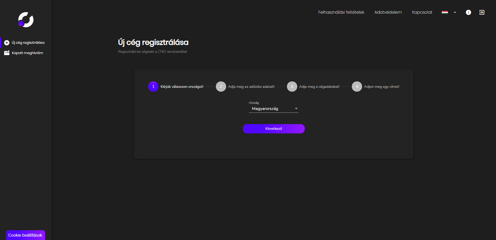
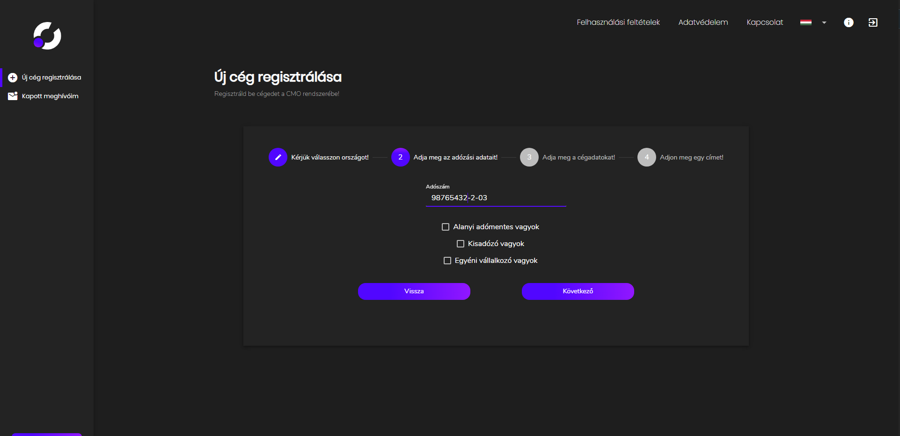
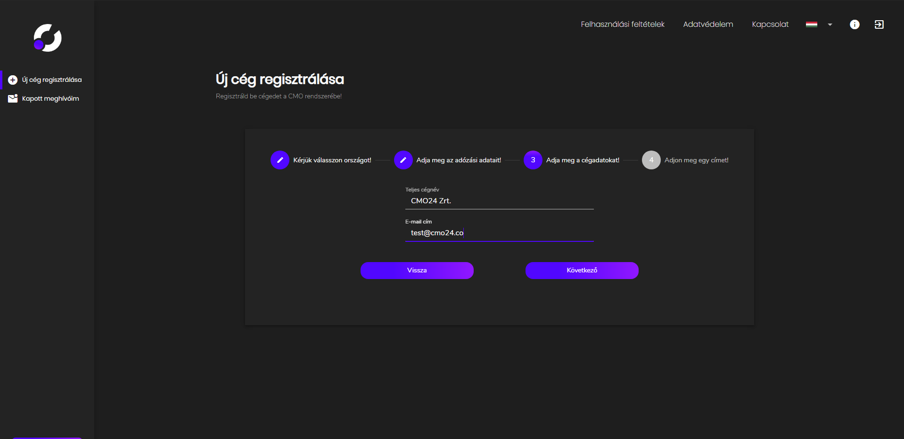
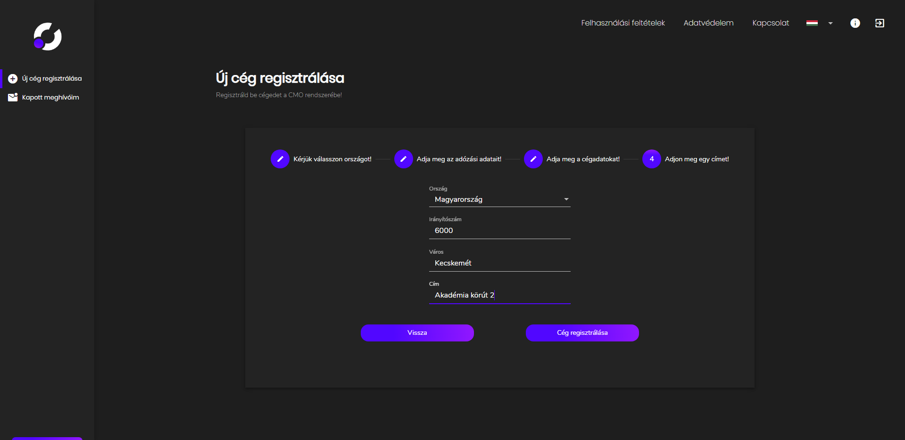
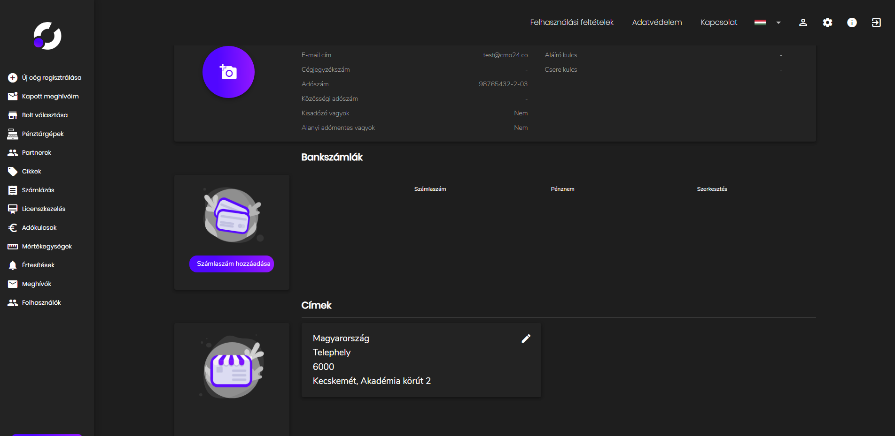
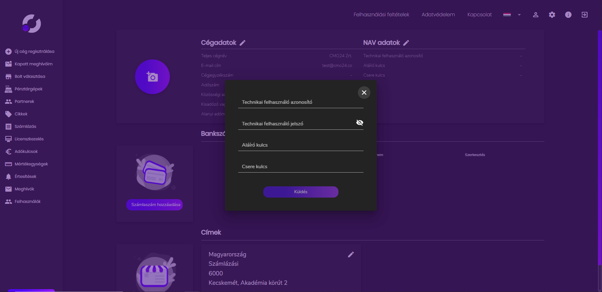

# Használati útmutató

## Regisztráció

### Felhasználó létrehozása

> A CMO - Company webalkalmazás a [https://app.cmo.hu/](https://app.cmo.hu/) oldalon érhető el!

A bejelentkező oldalon kattints a "Regisztráció" gombra.

Add meg a regisztrációs űrlapon a kért adatokat, fogadd el a felhasználási feltételeket, és az adatvédelmi nyilatkozatot, majd a "Küldés" gomb lenyomásával elindíthatod a regisztrációs folyamatot.

A megadott e-mail címre menni fog egy megerősítő kód, a regisztráció véglegesítéséhez. 
Amenyibben nem találod a beérkezett üzenetek mappában, kérlek ellenőrizd a spam -ek között is.

Utolsó lépésként jelentkezz be a webappba. Egy felugró ablakban meg kell adnod az e-mail címedre érkezett kódot, hogy a regisztráció befejezödjön.

### Cég regisztrálása

Válaszd ki az országot.

Add meg a vállalkozásod adószámát. Válaszd ki a jelölőnégyzetek segítségéval a cégformát, és adózási módot, ha szükséges.

Külső adatbázisból betöltjük a céged teljes nevét, vagy töltsd ki manuálisan.

Add meg vállalkozásod címét, ha nem töltődött volna ki automatikusan.

A következő oldal fog fogadni.

Ahhoz, hogy a számlázást is meg tudd kezdeni, szükséges a NAV technikai felhasználó beállítása. Ezt a [NAV Online Számla Rendszerében](https://onlineszamla.nav.gov.hu/home) tudod beállítani, és lekérdezni.

